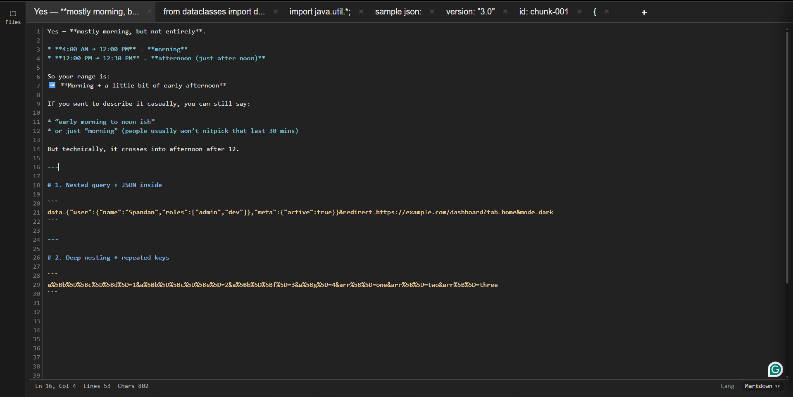
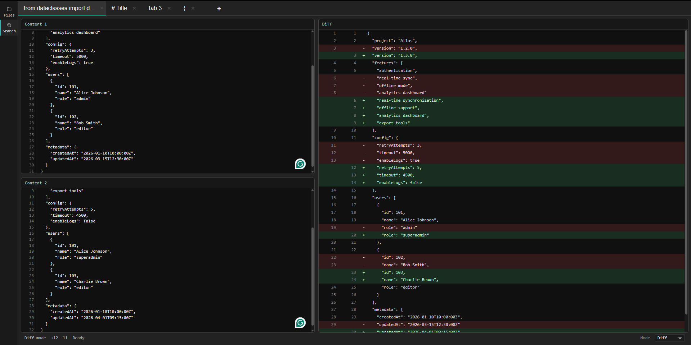
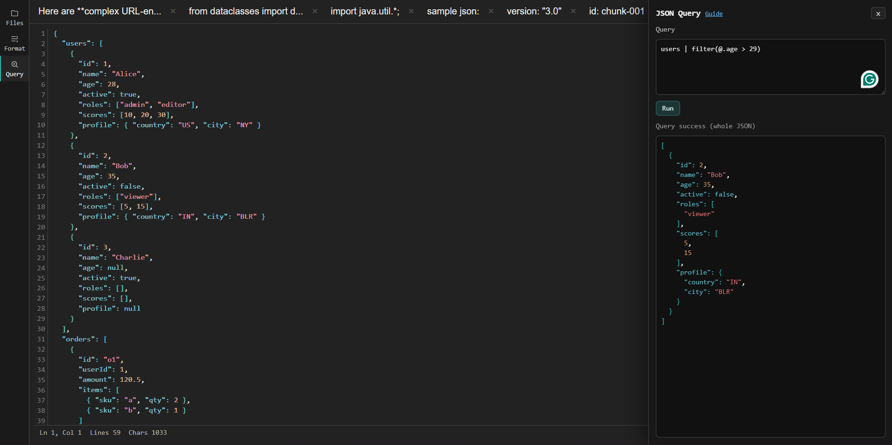

# scratchpad

scratchpad is a browser-only editor for day-to-day notes, code snippets, JSON workflows, and quick text transforms.

There is no backend. Your data stays in your browser and is persisted in IndexedDB.

## Highlights

- Multi-tab editing with local persistence
- Mode-based tabs (`text`, `json`, `diff`, `table`)
- Dedicated diff mode with side-by-side inputs and GitHub-style unified output
- Table mode with spreadsheet-style grid editing
- Syntax highlighting for text and JSON modes
- Powerful cross-tab fuzzy search with jump-to-result
- VS Code-style find/replace (regex, case, whole-word, replace one/all)
- Folding support (brace + indentation), gutter indicators, and fold toggles
- Decode tools (URL, Unicode escape, JWT header/payload, escaped string)
- JSON formatting tools (pretty/minified)
- JSON Query panel with JPL pipelines
- Undo/redo with bounded history for predictable memory use

## Keyboard Shortcuts

- `Ctrl+F`: Open Find
- `Ctrl+H`: Open Find and Replace
- `Ctrl+Z`: Undo
- `Ctrl+Y`: Redo
- `Ctrl+Shift+[` : Fold current block
- `Ctrl+Shift+]` : Unfold current block (or unfold all)
- `Alt+ArrowUp / Alt+ArrowDown`: Move selected line block up/down
- `Shift+Alt+ArrowUp / Shift+Alt+ArrowDown`: Duplicate selected line block up/down
- `Ctrl+Shift+K`: Delete selected line block
- `Ctrl+Enter`: Insert line below (preserve indentation)
- `Ctrl+Shift+Enter`: Insert line above (preserve indentation)
- `Ctrl+C` (no selection): Copy current line
- `Ctrl+X` (no selection): Cut current line
- `Tab`: Indent cursor/selection
- `Shift+Tab`: Outdent cursor/selection
- `Ctrl+/`: Toggle line comment for current line/selection
- `Ctrl+D`: Duplicate selection (or current line)
- `Ctrl+L`: Select current line

## Run
Visit: [https://hasinaxp.github.io/scratchpad/](https://hasinaxp.github.io/scratchpad/)

Or run locally by opening `index.html` in a browser.

## Screenshots

### Editor View

### Diff Mode

### JSON Query Panel

